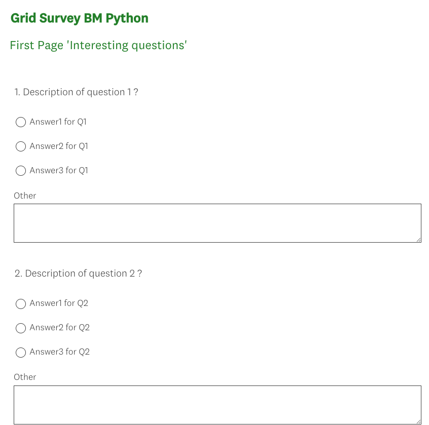

# Python practical tasks

## Task 2 — Create a Survey Using the SurveyMonkey API

### Requirements
To run the script:

```bash
python task1_3.py <filename>
```
Replace <filename> with the path to your JSON input file.

You can use the included secrets.txt file as a reference for formatting and structure.

### What This Script Does

This script interacts with the SurveyMonkey API to create a survey based on the structure defined in the provided JSON file.

### Result

After running the script, a new survey is created on SurveyMonkey with the structure defined in your input file.

<p align="center">  </p>


### Survey Structure

The created survey contains multiple pages and questions, exactly as described in the input JSON.

<p align="center">  </p> <p align="center">  </p>